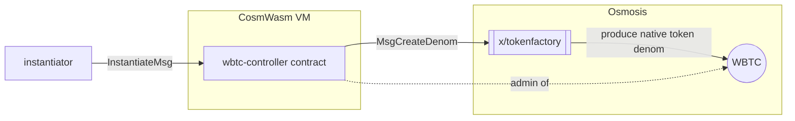
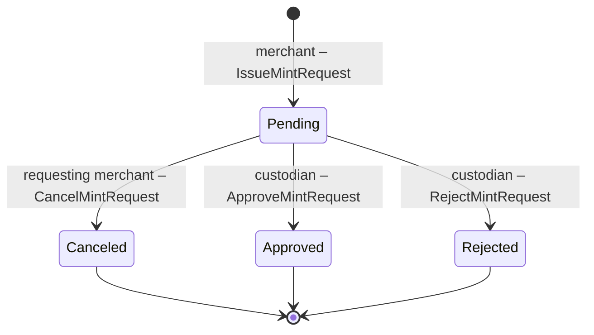
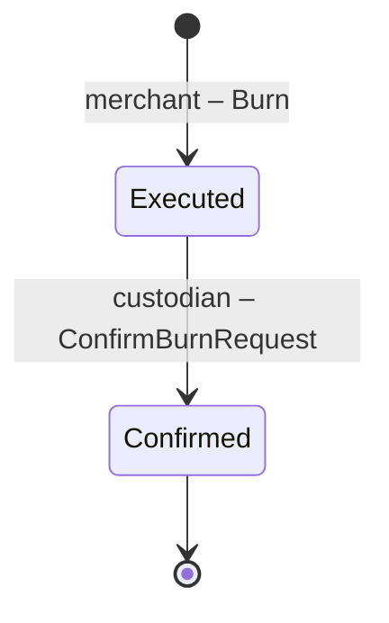

# CW-WBTC

This is a port of the [WBTC solidity contract](https://github.com/WrappedBTC/bitcoin-token-smart-contracts/tree/master/ethereumV2/contracts) to CosmWasm with slight modification.

## Overview

The original WBTC contracts is implemented with 4 separated contracts – `controller`, `members`, `factory` and `token`. Which seems to be that way due to solidity nature (functions can't just be imported from other modules). However, here we can implement them as a single contract to reduce unnessary complexity.

### Token Implementation

The origial WBTC is implemented as a ERC20 token which has been de facto standard on Ethereum for implementing token. However, on Osmosis, we can implement the token as native token through [`x/tokenfactory`](https://github.com/osmosis-labs/osmosis/tree/main/x/tokenfactory) module which reduce discrepancies between the native token and contract-based token like ERC20.

This is what happens on contract initialization:


Since the contract is an admin of the native WBTC token, mint and burn operation **MUST** be done through the contract, which means, authorizing how merchants and custodian can participating in minting and burning process can be handled by the contract itself.

Thus it does the job of `token` and `factory` contract in the original WBTC contract.

### Membership and Controller

Now that we have only single contract, handling membership is just the matter of keeping track of the addresses of merchants, custodian and the governor who can update the membership in the contract's state (TBD). Even if the governor is a multisig or a DAO, it still can be referenced as a single address in the contract.

For the original [`Controller.sol`](https://github.com/WrappedBTC/bitcoin-token-smart-contracts/blob/master/ethereumV2/contracts/controller/Controller.sol) contract, it is there only to wire all the contracts together which is not necessary since we only have single contract. So we can just ignore it.


### Request State Machine
How request states are defined in the contract is a little bit different from the original WBTC contract. It is defined to match the actual valid status of each request type instead of sharing the same state for all request types.


The following diagram define the state machine for each request type. The state transition label has the following pattern:
```
<authorized sender> – <message>
```


#### Mint Request


#### Burn Request



## Setup

Install [`beaker`](https://github.com/osmosis-labs/beaker)

```sh
cargo install -f beaker
```

Setup localosmosis

```
git clone https://github.com/osmosis-labs/osmosis.git
cd osmosis
make localnet-init && make localnet-start
```


Run `setup_test_contract` task to deploy the contract, set merchants and custodian.

```sh
beaker task run setup_test_contract -- --signer test1 --build_flags no_wasm_opt --network local
```

## Interactive console

To interact with the contract, run `beaker console`.
```sh
beaker console --network local
```

Setup console environment
```js
wbtc = contract['wbtc-controller']
governor = wbtc.signer(test1)
custodian = wbtc.signer(test2)
merchants = [wbtc.signer(test3), wbtc.signer(test4)]
```

Check if the roles are set correctly
```js
await wbtc.isGovernor({ address: test1.address }) // => { is_governor: true }
await wbtc.isCustodian({ address: test2.address }) // => { is_custodian: true }
await wbtc.isMerchant({ address: test3.address }) // => { is_merchant: true }
await wbtc.isMerchant({ address: test4.address }) // => { is_merchant: true }
```

Try executing a contract and check the emitted events

```js
result = await merchants[0].issueMintRequest({ amount: "10000000", depositAddress: "xxxxxx", txId: "xxxxxxxx" })
// =>
// {
//   logs: [ { msg_index: 0, log: '', events: [Array] } ],
//   height: 92912,
//   transactionHash: 'AA952B8B53DCBE92D9229A0DDCB3FDD4B7149E16931B52469F40A4CB60107A91',
//   gasWanted: 188392,
//   gasUsed: 167780
// }

console.dir(result.logs[0].events, {depth: null})
// =>
// [
//   {
//     type: 'execute',
//     attributes: [
//       {
//         key: '_contract_address',
//         value: 'osmo19y9uedlq0cpugg5a5jtxn8vs5rdwepnk7v863qmyc0p0899dfxxq5r8q8u'
//       }
//     ]
//   },
//   {
//     type: 'message',
//     attributes: [
//       { key: 'action', value: '/cosmwasm.wasm.v1.MsgExecuteContract' },
//       { key: 'module', value: 'wasm' },
//       {
//         key: 'sender',
//         value: 'osmo1qwexv7c6sm95lwhzn9027vyu2ccneaqad4w8ka'
//       }
//     ]
//   },
//   {
//     type: 'wasm',
//     attributes: [
//       {
//         key: '_contract_address',
//         value: 'osmo19y9uedlq0cpugg5a5jtxn8vs5rdwepnk7v863qmyc0p0899dfxxq5r8q8u'
//       },
//       { key: 'action', value: 'issue_mint_request' },
//       {
//         key: 'requester',
//         value: 'osmo1qwexv7c6sm95lwhzn9027vyu2ccneaqad4w8ka'
//       },
//       { key: 'amount', value: '10000000' },
//       { key: 'tx_id', value: 'xxxxxxxx' },
//       { key: 'deposit_address', value: 'xxxxxx' },
//       { key: 'block_height', value: '92912' },
//       { key: 'timestamp', value: '1684316814799465209' },
//       { key: 'transaction_index', value: '0' },
//       { key: 'nonce', value: '0' },
//       {
//         key: 'request_hash',
//         value: 'R3nfR12vjFv3/HDpnc0ToRE0Ir5/SsKJajr5T5GA38M='
//       }
//     ]
//   }
// ]
```

Find more available methods in [`ts/sdk/types/contracts/WbtcController.client.d.ts`](./ts/sdk/types/contracts/WbtcController.client.d.ts). As you might notice, the methods are generated from the contract's schema and could be imported as javascript/typescript module.

Find out how to use console in [Beaker's readme](https://github.com/osmosis-labs/beaker#console)
