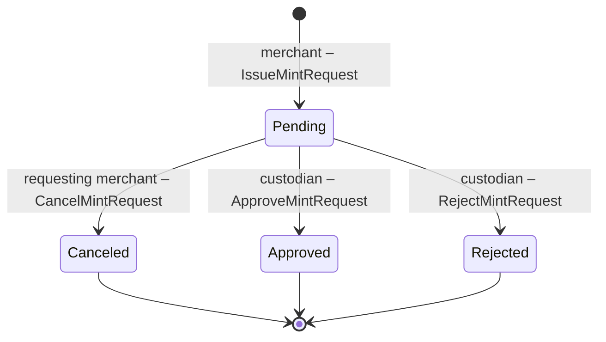
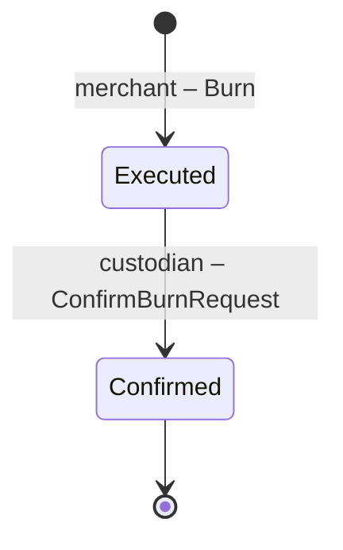

# CW-WBTC

This is a port of the [WBTC solidity contract](https://github.com/WrappedBTC/bitcoin-token-smart-contracts/tree/master/ethereumV2/contracts) to CosmWasm with slight modification.


## Setup

Install [`beaker`](https://github.com/osmosis-labs/beaker)

```sh
cargo install -f beaker
```

Setup localosmosis

```
git clone https://github.com/osmosis-labs/osmosis.git
cd osmosis
make localnet-init && make localnet-start
```


Run `setup_test_contract` task to deploy the contract, set merchants and custodian.

```sh
beaker task run setup_test_contract -- --signer test1 --build_flags no_wasm_opt --network local
```

## Interactive console

To interact with the contract, run `beaker console`.
```sh
beaker console --network local
```

Setup console environment
```js
wbtc = contract['wbtc-controller']
owner = wbtc.signer(test1)
custodian = wbtc.signer(test2)
merchants = [wbtc.signer(test3), wbtc.signer(test4)]
```

Check if the roles are set correctly
```js
await wbtc.isOwner({ address: test1.address }) // => { is_owner: true }
await wbtc.isCustodian({ address: test2.address }) // => { is_custodian: true }
await wbtc.isMerchant({ address: test3.address }) // => { is_merchant: true }
await wbtc.isMerchant({ address: test4.address }) // => { is_merchant: true }
```

Try executing a contract and check the emitted events

```js
result = await merchants[0].issueMintRequest({ amount: "10000000", depositAddress: "xxxxxx", txId: "xxxxxxxx" })
// =>
// {
//   logs: [ { msg_index: 0, log: '', events: [Array] } ],
//   height: 92912,
//   transactionHash: 'AA952B8B53DCBE92D9229A0DDCB3FDD4B7149E16931B52469F40A4CB60107A91',
//   gasWanted: 188392,
//   gasUsed: 167780
// }

console.dir(result.logs[0].events, {depth: null})
// =>
// [
//   {
//     type: 'execute',
//     attributes: [
//       {
//         key: '_contract_address',
//         value: 'osmo19y9uedlq0cpugg5a5jtxn8vs5rdwepnk7v863qmyc0p0899dfxxq5r8q8u'
//       }
//     ]
//   },
//   {
//     type: 'message',
//     attributes: [
//       { key: 'action', value: '/cosmwasm.wasm.v1.MsgExecuteContract' },
//       { key: 'module', value: 'wasm' },
//       {
//         key: 'sender',
//         value: 'osmo1qwexv7c6sm95lwhzn9027vyu2ccneaqad4w8ka'
//       }
//     ]
//   },
//   {
//     type: 'wasm',
//     attributes: [
//       {
//         key: '_contract_address',
//         value: 'osmo19y9uedlq0cpugg5a5jtxn8vs5rdwepnk7v863qmyc0p0899dfxxq5r8q8u'
//       },
//       { key: 'action', value: 'issue_mint_request' },
//       {
//         key: 'requester',
//         value: 'osmo1qwexv7c6sm95lwhzn9027vyu2ccneaqad4w8ka'
//       },
//       { key: 'amount', value: '10000000' },
//       { key: 'tx_id', value: 'xxxxxxxx' },
//       { key: 'deposit_address', value: 'xxxxxx' },
//       { key: 'block_height', value: '92912' },
//       { key: 'timestamp', value: '1684316814799465209' },
//       { key: 'transaction_index', value: '0' },
//       { key: 'nonce', value: '0' },
//       {
//         key: 'request_hash',
//         value: 'R3nfR12vjFv3/HDpnc0ToRE0Ir5/SsKJajr5T5GA38M='
//       }
//     ]
//   }
// ]
```

Find more available methods in [`ts/sdk/types/contracts/WbtcController.client.d.ts`](./ts/sdk/types/contracts/WbtcController.client.d.ts). As you might notice, the methods are generated from the contract's schema and could be imported as javascript/typescript module.

Find out how to use console in [Beaker's readme](https://github.com/osmosis-labs/beaker#console)


## Flows


### mint


### burn

